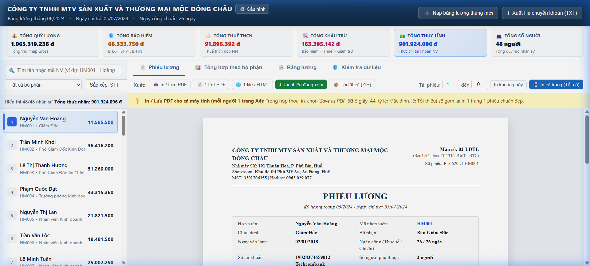
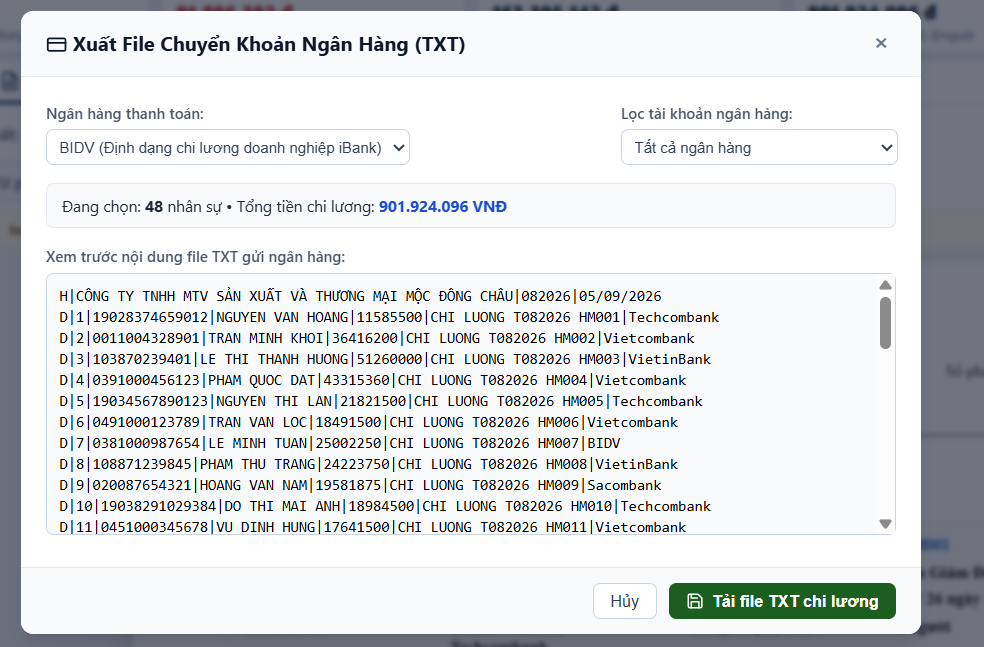

# 🏢 Hệ Thống Quản Lý & Xuất Phiếu Lương Doanh Nghiệp (Mộc Đông Châu)

<div align="center">


**Giải pháp phần mềm web tinh gọn, chuyên nghiệp phục vụ công tác tính lương, in ấn phiếu lương chuẩn khổ A4, thống kê ngân sách phòng ban và tạo file chi lương ngân hàng tự động.**

[🚀 TRẢI NGHIỆM TRỰC TIẾP TRÊN GITHUB PAGES](https://nhat-hieu.github.io/Payslip_MDC/)

</div>

---

## 📸 Giao Diện Trực Quan (Demo Showcase)

### 1. Xem & In Phiếu Lương Chuẩn Khổ A4 (Tab 1)
> Phiếu lương được thiết kế chuẩn xác theo mẫu biểu **02-LĐTL**, định dạng sắc nét, căn chỉnh lề (Margin) vừa khít trên đúng **1 trang A4**, loại bỏ hoàn toàn hiện tượng tràn viền.

<div align="center">
  
</div>

---

### 2. Xuất File Chi Lương Ngân Hàng Tự Động (TXT Batch Transfer)
> Hỗ trợ tạo file bảng kê chi lương hàng loạt theo định dạng chuẩn của các ngân hàng thương mại lớn (BIDV iBank, Vietcombank DigiBiz, Techcombank...). Kế toán chỉ cần nạp file lên Internet Banking và duyệt lệnh 1 lần duy nhất cho toàn bộ nhân sự.

<div align="center">
  
</div>

---

## ✨ Tính Năng Cốt Lõi

| Nhóm chức năng | Chi tiết tính năng |
| :--- | :--- |
| 📄 **Phiếu Lương Cá Nhân** | • Hiển thị 2 cột chuẩn: **NỘI DUNG** & **SỐ TIỀN (VNĐ)**<br>• Dịch số tiền thực nhận thành chữ tiếng Việt chính xác 100%<br>• Vùng ký tên tay rộng rãi, không in sẵn tên, tạo điều kiện ký & đóng dấu thực tế<br>• Hỗ trợ **In đơn lẻ** hoặc **In hàng loạt (Batch Print)** toàn bộ công ty trong 1 lần in |
| 📊 **Thống Kê Phòng Ban** | • Biểu đồ thanh ngang (Horizontal Bar Chart) so sánh chi phí lương giữa các bộ phận<br>• Bảng phân tích chi tiết: Tổng lương Gross, Bảo hiểm, Thuế TNCN, Thực lĩnh Net, Tỷ trọng chi phí % |
| 📋 **Bảng Lương Tổng Hợp** | • Toàn bộ danh sách nhân sự công ty với đầy đủ các khoản thu nhập & giảm trừ<br>• Xuất file bảng lương định dạng **Excel (.xlsx)** hoặc **CSV** chỉ với 1 cú click |
| 📥 **Nhận Diện Excel Tự Động** | • Kế toán chỉ cần kéo thả file Excel vào hệ thống<br>• Tự động quét và nhận diện tháng/năm kỳ lương (tự động cập nhật mã phiếu dạng `PL082026-HM002`)<br>• Nhận diện linh hoạt tên các cột trong bảng lương |
| ⚙️ **Cấu Hình Linh Hoạt** | • Tùy chỉnh thông tin công ty (Tên, Nhà máy, Showroom, MST, Hotline)<br>• Cài đặt ngày công chuẩn trong tháng (26, 24, 22 ngày...)<br>• Tự do điều chỉnh tỷ lệ trích trừ bảo hiểm của người lao động: **% BHXH**, **% BHYT**, **% BHTN** |
| 🔒 **Bảo Mật Tuyệt Đối** | • **Zero Backend:** Toàn bộ quá trình đọc file, phân tích và xuất dữ liệu diễn ra hoàn toàn trong bộ nhớ RAM trình duyệt của kế toán<br>• Không gửi và không lưu trữ bất kỳ thông tin nhân sự hay tiền lương nào lên máy chủ bên ngoài |

---

## 🛠️ Công Nghệ Phát Triển (Tech Stack)

* **Core:** HTML5 Semantic, Modern CSS3 (Flexbox & CSS Grid), Pure Vanilla JavaScript (ES6+).
* **Print Styling:** `@media print` tối ưu theo quy chuẩn máy in văn phòng, khóa tỷ lệ trang cứng cáp.
* **Libraries:**
  * [SheetJS (xlsx.full.min.js)](https://sheetjs.com/) — Phân tích và xuất dữ liệu bảng tính Excel.
  * [JSZip](https://stuk.github.io/jszip/) — Nén gói tải về toàn bộ phiếu lương hàng loạt dưới dạng file ZIP.
  * [html2pdf.js](https://ekoopmans.github.io/html2pdf.js/) — Kết xuất tài liệu PDF chất lượng cao.

---

## 📂 Cấu Trúc Thư Mục (Project Structure)

```text
Payslip_MDC/
├── assets/                    # Hình ảnh demo, ảnh minh họa giao diện
│   ├── demo-payslip.png
│   └── demo-bank-export.png
├── css/
│   ├── main.css               # Giao diện responsive, bảng lương, KPI widgets
│   └── print.css              # Bộ lọc CSS in ấn chuyên sâu cho khổ giấy A4
├── js/
│   ├── app.js                 # Điều phối giao diện chính, bộ lọc tìm kiếm & KPI
│   ├── data.js                # Cấu hình công ty, logic tính thuế TNCN & bảo hiểm
│   ├── payslip.js             # Dựng mẫu phiếu lương 02-LĐTL và xuất file
│   ├── department.js          # Thuật toán thống kê và dựng biểu đồ phòng ban
│   ├── payroll-table.js       # Bảng tổng hợp lương toàn công ty & xuất Excel
│   ├── bank-export.js         # Module xuất định dạng file TXT chi lương ngân hàng
│   ├── excel-importer.js      # Module đọc & tự động nhận diện file Excel kế toán
│   └── vietnamese-number.js   # Thuật toán đọc số tiền tiếng Việt thành chữ
├── libs/                      # Các thư viện bổ trợ chạy offline độc lập
├── index.html                 # Trang giao diện chính của hệ thống
├── server.js                  # Máy chủ tĩnh Node.js phục vụ chạy localhost
├── chay-he-thong.bat          # File khởi động nhanh hệ thống trên Windows
└── README.md                  # Tài liệu giới thiệu và hướng dẫn dự án
```

---

## 🚀 Hướng Dẫn Sử Dụng

### Cách 1: Sử dụng trực tiếp trên Web (Khuyên dùng)
Không cần cài đặt bất kỳ phần mềm nào, truy cập ngay:
👉 **[https://nhat-hieu.github.io/Payslip_MDC/](https://nhat-hieu.github.io/Payslip_MDC/)**

### Cách 2: Khởi chạy trên máy tính cá nhân (Offline / Localhost)
1. Tải hoặc clone mã nguồn về máy:
   ```bash
   git clone https://github.com/Nhat-Hieu/Payslip_MDC.git
   ```
2. Khởi chạy hệ thống:
   * **Cách nhanh:** Nhấp đúp chuột vào file `chay-he-thong.bat`.
   * **Hoặc mở Terminal/CMD gõ:**
     ```bash
     npm start
     ```
3. Mở trình duyệt web truy cập: `http://localhost:3000`

---

## 📄 Bản Quyền (License)

Dự án được phát hành theo giấy phép [MIT License](LICENSE). Được thiết kế và xây dựng bởi **Hồ Tăng Nhật Hiếu** ([@Nhat-Hieu](https://github.com/Nhat-Hieu)).
